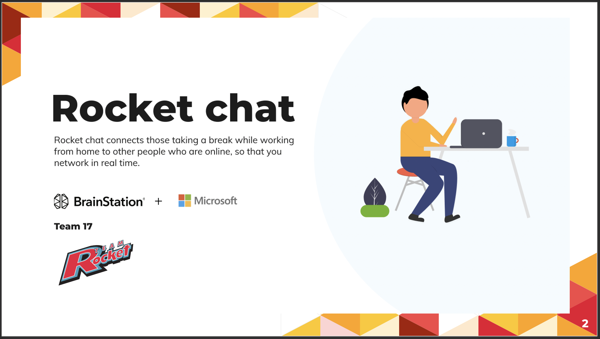
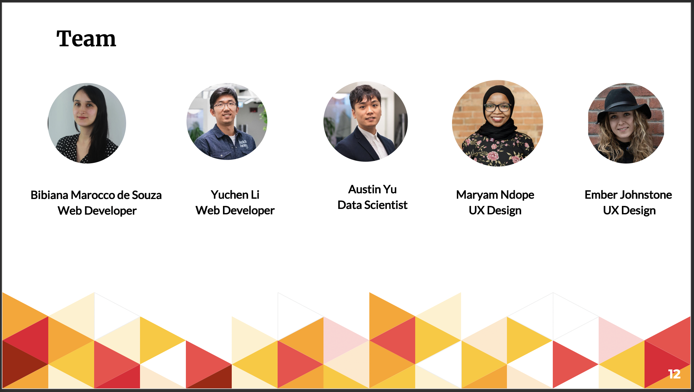

# BrainStation X Microsoft Hackathon

 

  

## Introduction 
The COVID - 19 pandemic is a terrible agent of change and BrainStation X Microsoft have an opportunity to leverage this hackathon for us to create new tools and processes that will help people thrive both during, and after the self isolation time. 

## Problem Statement 
How might we create a safe online space that facilitates easeful and organic networking with new, interesting people right away?

## RocketChat
A web app that connects those taking a break while working from home to other people who are online, so that you network in real time.

Whether you want to chat with other people in your profession, or branch out and explore someone else’s realm-let, RocketChat helps you feel connected. 

## Dataset
We created our own dataset through a survey. 

Survey Link: https://docs.google.com/forms/d/e/1FAIpQLSd29OZr6-dX6shg7QXY3J9mbLoo75QHXhntYXMljERpRplT5w/viewform

## Team 17: Team Rocket 

 

  

LinkedIn Profile: https://www.linkedin.com/in/austin-yu-a6a26419b/

## Completion Time
* 3 Days
